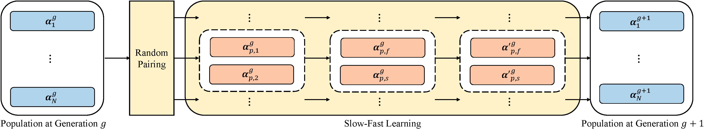

# Relative Neural Architecture Search via Slow-Fast Learning
The implementation of the paper
> [RelativeNAS: Relative Neural Architecture Search via Slow-Fast Learning](https://arxiv.org/abs/2009.06193) \
> Hao Tan, Ran Cheng, Shihua Huang, Cheng He, Changxiao Qiu, Fan Yang, Ping Luo.\
> _arXiv:2009.06193_.

<p align="center">
  
</p>

## Requirements
```
Python >= 3.6, PyTorch == 1.3.0, torchvision >= 0.2
```

**RelativeNAS** is based on continuous encoding in cell-based search space. 
Besides, it uses a slow-fast learning paradigm to iteratively update the architecture vectors in the population.
A weight set is also contained to reduce the cost for performance estimations of candidate architectures.
Therefore, it can efficiently design high-performance convolutional architectures for image classification.
The architecture directly searched on CIFAR-10 can transfer into other intra- and inter-tasks, such as CIFAR-100, ImageNet, and PASCAL VOC 2007 et al.
The search process only requires a single GPU (1080 Ti) for nine hours.

**This code is based on the implementation of  [DARTS](https://github.com/quark0/darts) and [DenseNAS](https://github.com/JaminFong/DenseNAS.git).**


## Pretrained models
Our pretrained models are provided for evaluation.

**CIFAR-10** ([cifar10.pt](./trained_model/cifar10_model.pt))
```
 python test.py --auxiliary --model_path ./trained_model/cifar10_model.pt --set cifar10
```
* Expected result: 2.26% test error rate with 3.93M model params.

**CIFAR-100** ([cifar100_model.pt](./trained_model/cifar100_model.pt))
```
 python test.py --auxiliary --model_path ./trained_model/cifar100_model.pt --set cifar100
```
* Expected result: 15.86% test error rate with 3.98M model params.

**ImageNet** ([imagenet.pt](./trained_model/imagenet_model.pt))
1. We pack the ImageNet data as the lmdb file for faster IO. The lmdb files can be made as follows. 

    1). Generate the list of the image data.<br>
    ```
    python dataset/mk_img_list.py --image_path 'the path of your image data' --output_path 'the path to output the list file'
    ```
    2). Use the image list obtained above to make the lmdb file.<br>
    ```
    python dataset/img2lmdb.py --image_path 'the path of your image data' --list_path 'the path of your image list' --output_path 'the path to output the lmdb file' --split 'split folder (train/val)'
    ```

2. 
```
 python test_imagenet.py --auxiliary --model_path ./trained_model/imagenet_model.pt --arch RelativeNAS --gpus 0,1 --data_path 'the path of your image data (lmdb)'
```
* Expected result: 24.88% top-1 error and 7.7% top-5 with 5.05M model params.

## Architecture search (using small proxy models)
To carry out architecture search on CIFAR-10, run
```
python train_search.py     # for conv cells on CIFAR-10
```

In detail, ```model_search.py``` is used to define the model. 
It uses ```nn.ModuleList()``` to contain all the possible operations and only initial its own operations.
```arch_info``` attribute is used to specify what operations the model has.

```slow_fast_learning.py``` defines all the tools for the slow-fast learning, such as population initialization, architecture decoding, et. al.
The rule to update the weight set is also defined.

## Architecture evaluation (using full-sized models)
To evaluate our architecture by training from scratch, run
```
python train.py --auxiliary --cutout --set cifar10
```
Customized architectures are supported through the `--arch` flag once specified in `genotypes.py`.

**ImageNet**

Training the searched model over ImageNet dataset with the following script.<br>
```
python train_imagenet.py --data_path 'The path of ImageNet lmdb data' --init_channels 46 --layers 14 --arch RelativeNAS --gpus 0,1,2,3
```

**TransferLearning Tasks**

Please refer to the [TrasferLearning-Tasks](https://github.com/EMI-Group/TransferLearning-Tasks) for the trasfer learning tasks in our RelativeNAS.  


## Citation
If you use our code in your research, please cite our [paper](https://arxiv.org/abs/2009.06193):
```
@article{tan2020relative,
  title={RelativeNAS: Relative Neural Architecture Search via Slow-Fast Learning},
  author={Tan, Hao and Cheng, Ran and Huang, Shihua and He, Cheng and Qiu, Changxiao and Yang, Fan and Luo, Ping},
  journal={arXiv preprint arXiv:2009.06193},
  year={2020}
}
```
