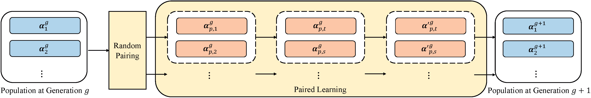

# Continuously Encoded Neural Architecture Search by Paired Learning
Raw code accompanying the paper
> [PairNAS: Continuously Encoded Neural Architecture Search by Paired Learning](https://arxiv.org/abs/1806.09055) \
> Hao Tan, Ran Cheng, Shihua Huang, Cheng He, Changxiao Qiu, Fan Yang, Ping Luo.\
> _arXiv:1806.09055_.

<p align="center">
  
</p>

## Requirements
```
Python >= 3.6, PyTorch >= 1.0, torchvision >= 0.2
```

The algorithm is based on continuous encoding in the cell-based search space. 
It is able to efficiently design high-performance convolutional architectures for image classification.
The architecture directly searched on CIFAR-10 can transfer into other intra- and inter-tasks, such as CIFAR-100, ImageNet, and PASCAL VOC 2007 et al.
The search process only requires a single GPU (1080 Ti) for nine hours.

**This code is based on the implementation of  [DARTS](https://github.com/quark0/darts).**


## Pretrained models
The easist way to get started is to evaluate our pretrained models.

**CIFAR-10** ([cifar10.pt](./trained_model/cifar10_model.pt))
```
 python test.py --auxiliary --model_path ./trained_model/cifar10_model.pt --set cifar10
```
* Expected result: 2.34% test error rate with 3.93M model params.

**CIFAR-100** ([cifar100_model.pt](./trained_model/cifar100_model.pt))
```
 python test.py --auxiliary --model_path ./trained_model/cifar100_model.pt --set cifar100
```
* Expected result: 15.86% test error rate with 3.98M model params.

**ImageNet** ([imagenet.pt](./trained_model/imagenet_model.pt))
```
 python test.py --auxiliary --model_path ./trained_model/imagenet_model.pt --set cifar100
```
* Expected result: 24.88% top-1 error and 7.7% top-5 with 5.05M model params.


## Architecture evaluation (using full-sized models)
To evaluate our best cells by training from scratch, run
```
python train.py --auxiliary --cutout            # CIFAR-10
```
Customized architectures are supported through the `--arch` flag once specified in `genotypes.py`.


## Citation
If you use any part of this code in your research, please cite our [paper](https://arxiv.org/abs/1806.09055):
```
@article{liu2018darts,
  title={DARTS: Differentiable Architecture Search},
  author={Liu, Hanxiao and Simonyan, Karen and Yang, Yiming},
  journal={arXiv preprint arXiv:1806.09055},
  year={2018}
}
```
